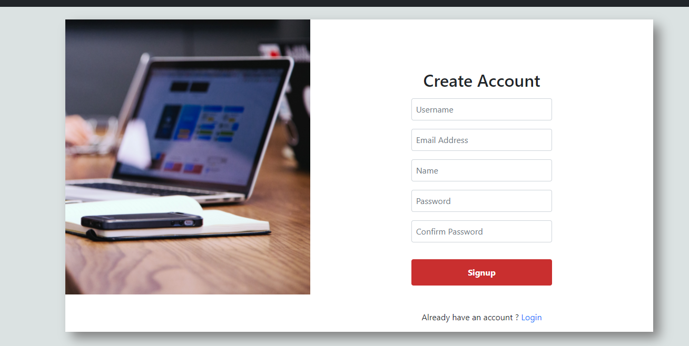

Welcome to Samvadika's documentation!
=====================================
Welcome to Samvadika - online interaction platform developed using Django for IIT Bombay. This project aims at solving the problems faced by students by interacting with other people by posting their questions in discussions section. It also helps us to find people with specific interests which is the main hurdle in this current online setting..

.. toctree::
   :maxdepth: 5
   :caption: Contents:

Authentication System
=====================================
* A secured authentication system was developed to let users Signup using Register here option by providing required details.
* Registered users can proceed to login to the system by providing valid credentials
* **Note**: This sytem restricted users to register with IIT B domain email only to ensure users authenticity.
* Below are the example screens of the system:

.. figure:: /images/authentication_1.PNG
  :alt: authentication_1
  :target: https://127.0.0.1:8000
  :align: center

|

|

Samvadika
==============================================
* After successful login, users will prompt to the homepage where Users where existing discussions are shown along with personalized dashboard.
* Below are the functionalities, Samvadika provides to the users.

  1. `Discussion section`_
  2. `Score tab`_
  3. `Find People`_
  4. `Notifications`_
  5. `Saved Items`_
  6. `Update Profile`_

Discussion section
--------------------------------------
* To post Query, user must select one or more tags from the provided list. This restriction is to enable Filter Questions by Tags functionality.

.. figure:: /images/homepage_1.PNG
  :alt: homepage_1
  :align: center

|

* With respect to existing queries, User can reply the particular question by clicking on view replies option and provide his thoughts on it.

.. figure:: /images/reply_1.PNG
  :alt: reply_1
  :align: center

|

* Apart from this for each question, User have the below options for each question posted in the platform.

  1. Upvote/downvote the question posted
  2. Upvote/downvote the reply posted for questions.
  3. Save Question option - This will save the question to `Saved Items`_ page.

* *Filter Question by Tag(s)* : This functionality provides users to search questions seamlessly by filtering them based on tags.

.. figure:: /images/filter_1.PNG
  :alt: filter_1
  :align: center

|

Score tab
--------------------------------------
* This score will be updated based on User posting questions and replies.
* Below are the details of the score update followed:

  1. +10 for posting a question.
  2. +10 for providing a reply to the question.
  3. +5 for upvote of a question or reply.
  4. -2 for downvote of a question or reply.
* **Note**: By default, User will be added a score of +5.

Find People
--------------------------------------
* This section is to find and connect people based on their interests or hobbies.
* To access this, for the first time User need to provide more than one hobbies along with Social Links.

.. figure:: /images/findpeople_1.PNG
  :alt: findpeople_1
  :align: center

* It will list all users details with their hobbies and social links.
* User can filter people with specific hobby/interest and connect with other people.

.. figure:: /images/findpeople_2.PNG
  :alt: findpeople_2
  :align: center

|

Notifications
--------------------------------------
* This section is dedicated to notifications for the user related activity happened.
* Below notifications are thrown to the user when:

  1. Users Posted Question has been answered.
  2. Score update related notifications.
  3. Upvote/Downvote notification for both question and answer.
  4. Saved Question notification for the corresponding user.

.. figure:: /images/notification.PNG
  :alt: notification
  :align: center

|

Saved Items
--------------------------------------
* This section is to enable Users Save or bookmark their important queries.
* It will help Users navigate to their Saved Questions and see replies from this page itself.

.. figure:: /images/saveditems.PNG
  :alt: saveditems
  :align: center

|

Update Profile
--------------------------------------
* Users can update their profile info from this section.
* It includes update of several fields such as:

  1. Email
  2. Name
  3. Password
  4. Profile photo
  5. Hobbies/Interests
  6. Social Links

.. figure:: /images/updateprofile.PNG
  :alt: updateprofile
  :align: center

|

* **Note**: Update of Hobbies and Social Links will not be provided unless first time form provided in Find people section is not filled by User, to ensure consistency of CRUD operations.